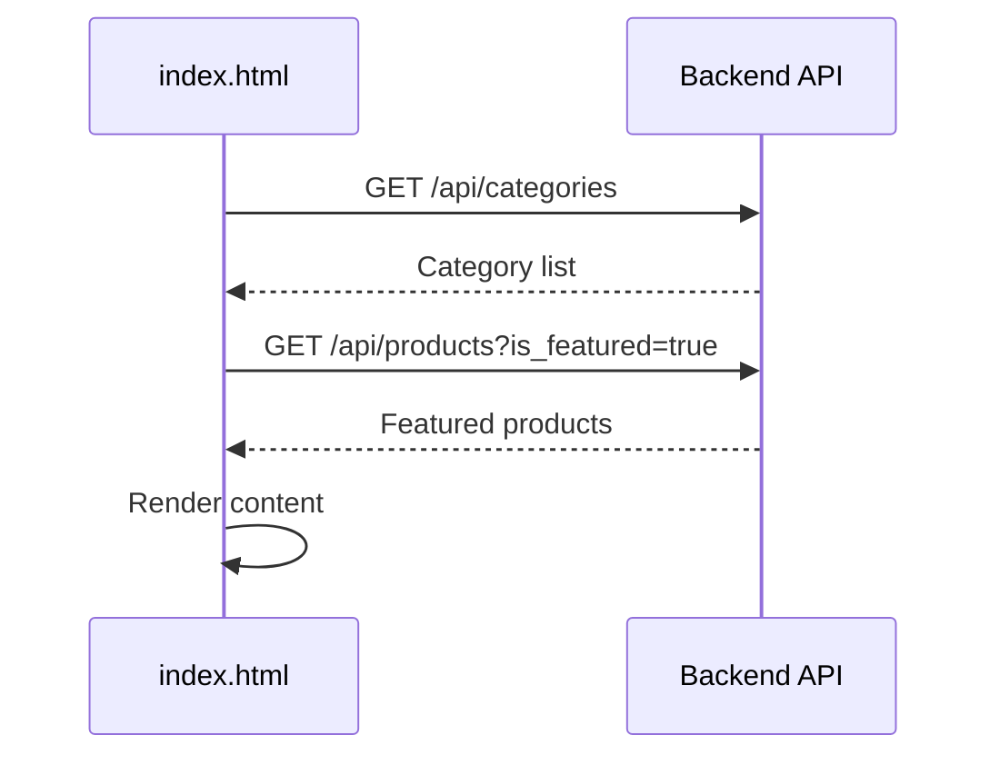
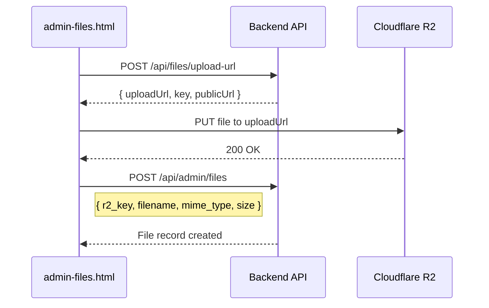
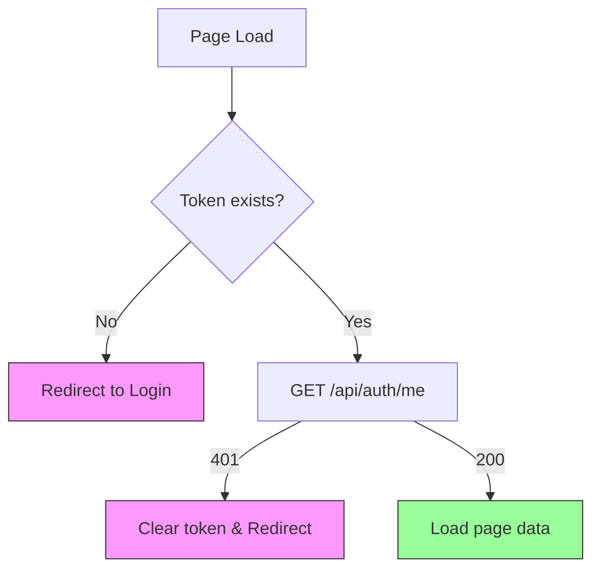

# API Integration Plan: Frontend ↔ Backend

This document outlines the comprehensive plan for integrating the static HTML frontend with the backend REST API. It maps each page to its required API endpoints, specifies data flows, and provides implementation details.

---

## Architecture Overview

```
┌─────────────────────┐     HTTP/HTTPS      ┌─────────────────────┐
│   Static Frontend   │ ←─────────────────→ │   Express Backend   │
│  (public/pages/*.html)                     │   (app/)            │
│  + JS Modules          JSON                │                     │
└─────────────────────┘                      └─────────────────────┘
        ↑                                           ↓
        │ localStorage                              │ PostgreSQL
        └── cart, tokens                            └── Data Storage
```

### Key Integration Points
- **API Base URL**: Configured in `public/js/config.js`
- **Authentication**: JWT tokens stored in `localStorage`
  - `token` → Customer access
  - `adminToken` → Admin access
- **Cart**: Managed locally, validated server-side at checkout

---

## Frontend JS Modules

| Module | Location | Purpose |
|--------|----------|---------|
| `config.js` | `/public/js/config.js` | API base URL, constants |
| `api.js` | `/public/js/api.js` | HTTP helper with auth headers |
| `auth.js` | `/public/js/auth.js` | Token management, guards |
| `cart.js` | `/public/js/cart.js` | Local cart operations |
| `utils.js` | `/public/js/utils.js` | Formatting, validation |
| `i18n.js` | `/public/js/i18n.js` | Translation loading |

---

## Store Pages Integration

### Homepage (`index.html`)

| Feature | API Endpoint | Method | Auth | Notes |
|---------|--------------|--------|------|-------|
| Categories Grid | `GET /api/categories` | GET | ❌ | Active categories only |
| Featured Products | `GET /api/products?is_featured=true&limit=8` | GET | ❌ | Featured filter |
| Store Settings | `GET /api/settings/public` | GET | ❌ | Store name, contact info |

**Data Flow:**


---

### Products Listing (`products.html`)

| Feature | API Endpoint | Method | Auth | Notes |
|---------|--------------|--------|------|-------|
| Product List | `GET /api/products` | GET | ❌ | Paginated listing |
| Category Filter | `GET /api/categories` | GET | ❌ | For sidebar filter |
| Products by Category | `GET /api/categories/:slug/products` | GET | ❌ | Category-specific |

**Query Parameters:**
- `page`, `limit` – Pagination
- `category` – Category slug
- `sort` – `price_asc`, `price_desc`, `newest`, `name`
- `search` – Search term
- `min_price`, `max_price` – Price range

---

### Product Detail (`product.html`)

| Feature | API Endpoint | Method | Auth | Notes |
|---------|--------------|--------|------|-------|
| Product Info | `GET /api/products/:slug` | GET | ❌ | Full detail + images |
| Related Products | `GET /api/products?category=:category&limit=4` | GET | ❌ | Same category |

**Response includes:**
- Product details (bilingual: `name_ar`, `name_en`)
- Images array with `is_primary`, `sort_order`
- Category reference
- Stock, price, old_price

---

### Cart (`cart.html`)

| Feature | Storage/API | Notes |
|---------|-------------|-------|
| Cart Items | `localStorage` | `cart.js` module |
| Product Validation | N/A | Validated at checkout |
| Remove/Update Qty | `localStorage` | Client-side only |

> [!NOTE]
> Cart is entirely client-side. Server validates stock and calculates final totals during checkout.

---

### Checkout (`checkout.html`)

| Feature | API Endpoint | Method | Auth | Notes |
|---------|--------------|--------|------|-------|
| Create Order | `POST /api/orders` | POST | ✅ | Server-calculated totals |
| User Addresses | `GET /api/addresses` | GET | ✅ | Pre-fill form |
| Settings | `GET /api/settings/public` | GET | ❌ | Shipping costs, payment info |

**Order Creation Payload:**
```json
{
  "customer_name": "string",
  "phone": "string",
  "address": "string",
  "city": "string",
  "postal_code": "string",
  "notes": "string",
  "payment_method": "cod|vodafone|instapay|fawry|bank",
  "items": [
    { "product_id": 1, "quantity": 2 }
  ]
}
```

> [!IMPORTANT]
> Server recalculates totals from current prices. Never trust client-side pricing.

---

### Order Success (`order-success.html`)

| Feature | API Endpoint | Method | Auth | Notes |
|---------|--------------|--------|------|-------|
| Order Details | `GET /api/orders/:orderNumber` | GET | ✅ | Confirmation details |
| Payment Proof Upload | `POST /api/files/upload-url` | POST | ✅ | Get signed R2 URL |
| Attach Proof | `POST /api/orders/:orderNumber/payment-proof` | POST | ✅ | Link uploaded file |

---

### My Orders (`my-orders.html`)

| Feature | API Endpoint | Method | Auth | Notes |
|---------|--------------|--------|------|-------|
| Order List | `GET /api/orders` | GET | ✅ | User's orders only |

---

### Order Detail (`order-detail.html`)

| Feature | API Endpoint | Method | Auth | Notes |
|---------|--------------|--------|------|-------|
| Order Info | `GET /api/orders/:orderNumber` | GET | ✅ | Full order + items |
| Cancel Order | `POST /api/orders/:orderNumber/cancel` | POST | ✅ | Pending only |
| Upload Proof | `POST /api/files/upload-url` | POST | ✅ | For payment |

---

## Authentication Pages

### Login (`login.html`)

| Feature | API Endpoint | Method | Notes |
|---------|--------------|--------|-------|
| Login | `POST /api/auth/login` | POST | Returns JWT |

**Request:**
```json
{ "email": "string", "password": "string" }
```

**Response:**
```json
{ "token": "jwt...", "user": { "id", "name", "email", "phone" } }
```

**Error Handling:**
- `401` – Invalid credentials
- `403` – Email not verified (show resend option)

---

### Register (`register.html`)

| Feature | API Endpoint | Method | Notes |
|---------|--------------|--------|-------|
| Register | `POST /api/auth/register` | POST | Creates account |

**Request:**
```json
{ "name": "string", "email": "string", "phone": "string", "password": "string" }
```

---

### Email Verification (`verify-email.html`)

| Feature | API Endpoint | Method | Notes |
|---------|--------------|--------|-------|
| Verify Token | `GET /api/auth/verify-email/:token` | GET | Automatic on load |
| Resend | `POST /api/auth/resend-verification` | POST | If expired |

---

### Password Reset (`forgot-password.html`, `reset-password.html`)

| Feature | API Endpoint | Method | Notes |
|---------|--------------|--------|-------|
| Request Reset | `POST /api/auth/forgot-password` | POST | Sends email |
| Reset | `POST /api/auth/reset-password` | POST | Token + new password |

---

### Profile (`profile.html`)

| Feature | API Endpoint | Method | Auth | Notes |
|---------|--------------|--------|------|-------|
| Get Profile | `GET /api/auth/me` | GET | ✅ | Current user |
| Update Profile | `PUT /api/auth/profile` | PUT | ✅ | Name, phone |
| Change Password | `PUT /api/auth/password` | PUT | ✅ | Current + new |
| List Addresses | `GET /api/addresses` | GET | ✅ | Saved addresses |
| Add Address | `POST /api/addresses` | POST | ✅ | New address |
| Update Address | `PUT /api/addresses/:id` | PUT | ✅ | Edit address |
| Delete Address | `DELETE /api/addresses/:id` | DELETE | ✅ | Remove address |

---

## Admin Pages Integration

> [!NOTE]
> All admin routes require `Authorization: Bearer <adminToken>` header.

### Admin Login (`admin-login.html`)

| Feature | API Endpoint | Method | Notes |
|---------|--------------|--------|-------|
| Login | `POST /api/auth/login` | POST | Same endpoint, check `is_admin` |

Store response in `localStorage.adminToken` if `user.is_admin === true`.

---

### Dashboard (`admin-dashboard.html`)

| Feature | API Endpoint | Method | Notes |
|---------|--------------|--------|-------|
| Metrics | `GET /api/admin/dashboard` | GET | Stats + recent orders |

**Response includes:**
- Total revenue, orders count
- Orders by status counts
- Recent orders list
- Low stock alerts

---

### Products (`admin-products.html`, `admin-product-form.html`)

| Feature | API Endpoint | Method | Notes |
|---------|--------------|--------|-------|
| List Products | `GET /api/admin/products` | GET | All products |
| Get Product | `GET /api/admin/products/:id` | GET | For edit form |
| Create Product | `POST /api/admin/products` | POST | New product |
| Update Product | `PUT /api/admin/products/:id` | PUT | Edit product |
| Delete Product | `DELETE /api/admin/products/:id` | DELETE | Remove product |
| Get Upload URL | `POST /api/files/upload-url` | POST | For images |
| Add Images | `POST /api/admin/products/:id/images` | POST | Link uploaded files |
| Set Primary Image | `PUT /api/admin/products/:id/images/:imageId/primary` | PUT | Primary flag |
| Delete Image | `DELETE /api/admin/products/:id/images/:imageId` | DELETE | Remove image |

**Product Create/Update Payload:**
```json
{
  "name_ar": "string",
  "name_en": "string",
  "price": 100.00,
  "old_price": 120.00,
  "category_id": 1,
  "stock": 50,
  "is_active": true,
  "description_ar": "string",
  "description_en": "string"
}
```

---

### Categories (`admin-categories.html`, `admin-category-form.html`)

| Feature | API Endpoint | Method | Notes |
|---------|--------------|--------|-------|
| List Categories | `GET /api/admin/categories` | GET | All categories |
| Get Category | `GET /api/admin/categories/:id` | GET | For edit |
| Create Category | `POST /api/admin/categories` | POST | New category |
| Update Category | `PUT /api/admin/categories/:id` | PUT | Edit category |
| Delete Category | `DELETE /api/admin/categories/:id` | DELETE | Remove category |

---

### Orders (`admin-orders.html`, `admin-order-detail.html`)

| Feature | API Endpoint | Method | Notes |
|---------|--------------|--------|-------|
| List Orders | `GET /api/admin/orders` | GET | Paginated, filterable |
| Get Order | `GET /api/admin/orders/:id` | GET | Full details + items |
| Update Status | `PUT /api/admin/orders/:id/status` | PUT | Status/payment |

**Query Parameters for List:**
- `page`, `limit`
- `status` – `pending`, `processing`, `shipped`, `delivered`, `cancelled`
- `payment_status` – `pending`, `paid`, `refunded`

**Status Update Payload:**
```json
{
  "status": "processing",
  "payment_status": "paid"
}
```

---

### Customers (`admin-customers.html`)

| Feature | API Endpoint | Method | Notes |
|---------|--------------|--------|-------|
| List Customers | `GET /api/admin/customers` | GET | Paginated list |
| Customer Orders | `GET /api/admin/customers/:id/orders` | GET | Order history |

---

### Files (`admin-files.html`)

| Feature | API Endpoint | Method | Notes |
|---------|--------------|--------|-------|
| List Files | `GET /api/admin/files` | GET | Media library |
| Get Upload URL | `POST /api/files/upload-url` | POST | Signed R2 URL |
| Register File | `POST /api/admin/files` | POST | Link R2 key to DB |
| Delete File | `DELETE /api/admin/files/:id` | DELETE | Remove file |

**File Upload Flow:**


---

### Settings (`admin-settings.html`)

| Feature | API Endpoint | Method | Notes |
|---------|--------------|--------|-------|
| Get Settings | `GET /api/admin/settings` | GET | All settings |
| Update Settings | `PUT /api/admin/settings` | PUT | Bulk update |

**Settings Structure:**
```json
[
  { "key": "store_name_ar", "value": "متجر زيت الزيتون", "type": "string", "group_name": "general" },
  { "key": "shipping_cost", "value": "50", "type": "number", "group_name": "shipping" }
]
```

---

## Implementation Checklist

### Phase 1: Core API Module Setup
- [ ] Verify `config.js` has correct API base URL
- [ ] Verify `api.js` handles auth headers correctly
- [ ] Verify `auth.js` token management (get/set/clear)
- [ ] Add error handling utilities

### Phase 2: Public Store Pages
- [ ] Homepage – Categories + Featured products
- [ ] Products Listing – Filters, pagination, search
- [ ] Product Detail – Full info + images + related
- [ ] Cart – Verify localStorage sync
- [ ] Checkout – Order creation flow
- [ ] Order Success – Confirmation + payment proof

### Phase 3: Authentication
- [ ] Login – JWT storage, redirect logic
- [ ] Register – Validation, success handling
- [ ] Email Verification – Token processing
- [ ] Password Reset – Both pages
- [ ] Profile – All CRUD operations

### Phase 4: Admin Panel
- [ ] Admin Login – Separate token storage
- [ ] Dashboard – Metrics loading
- [ ] Products – Full CRUD + image management
- [ ] Categories – CRUD operations
- [ ] Orders – List, detail, status updates
- [ ] Customers – List + order history
- [ ] Files – Upload + media management
- [ ] Settings – Read + bulk update

### Phase 5: Polish
- [ ] Loading states for all API calls
- [ ] Error handling with user-friendly messages
- [ ] Empty states for lists
- [ ] Form validation before submission
- [ ] RTL/LTR number formatting

---

## Error Handling Pattern

```javascript
// Standard error handling in page scripts
async function loadData() {
  try {
    showLoading();
    const response = await Api.get('/endpoint');
    renderData(response.data);
  } catch (error) {
    if (error.status === 401) {
      Auth.logout();
      window.location.href = '/pages/login.html';
    } else {
      showError(t('errors.load_failed'));
    }
  } finally {
    hideLoading();
  }
}
```

---

## Authentication Flow



---

## Token Storage

| Key | Purpose | Scope |
|-----|---------|-------|
| `token` | Customer JWT | Store pages |
| `adminToken` | Admin JWT | Admin pages |
| `cart` | Cart items JSON | Store pages |
| `lang` | Current language (ar/en) | All pages |

---

## Notes

1. **CORS**: Backend must allow frontend origin
2. **Rate Limiting**: Auth routes have stricter limits
3. **File Uploads**: Always use signed URLs from backend
4. **Validation**: Server validates all inputs; frontend validation is UX only
5. **Bilingual**: Use `name_ar`/`name_en` based on current `lang` setting
